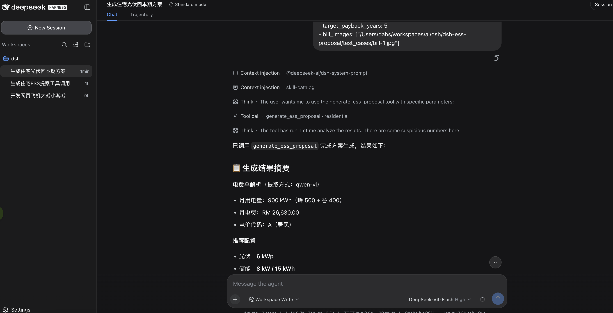
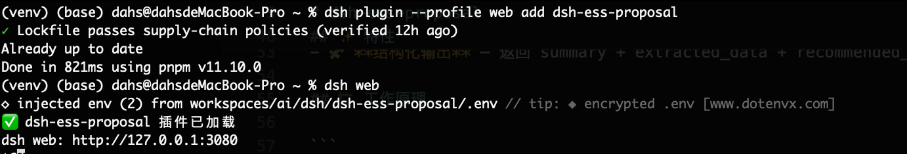
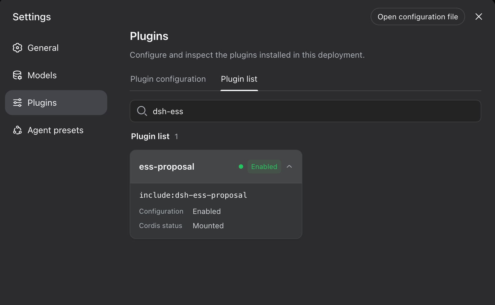

<div align="center">

# dsh-ess-proposal

**根据电费单一键生成「光伏 + 储能」方案的 DSH 插件（马来西亚市场）**
*A DSH plugin that turns an electricity bill into a solar + energy-storage proposal (Malaysia)*

[](https://github.com/deepseek-ai)
[](https://www.typescriptlang.org/)
[](https://bailian.console.aliyun.com/)
[](https://api.deepseek.com/)
[](./License)

**简体中文** ｜ [English](#-english)

</div>

---

## 目录

- [简介](#简介)
- [效果预览](#️-效果预览)
- [特性](#-特性)
- [工作原理](#️-工作原理)
- [目录结构](#-目录结构)
- [安装](#-安装)
- [配置](#️-配置)
- [使用](#-使用)
- [输出示例](#-输出示例)
- [数据与假设](#-数据与假设)
- [开发](#-开发)
- [Roadmap](#️-roadmap)
- [许可证](#-许可证)

## 简介

`dsh-ess-proposal` 是一个 **DSH（DeepSeek Harness）插件**，基于 [`@deepseek-ai/cordis`](https://www.npmjs.com/package/@deepseek-ai/cordis) 构建。它在 DSH 对话中注册一个 `generate_ess_proposal` 工具：上传一张马来西亚 TNB 电费单图片，即可自动**提取用电数据 → 推荐光伏/储能配置 → 测算投资、回收期与 ROI**，并给出结构化结果。

> ⚙️ 视觉提取优先使用阿里云百炼 **Qwen-VL**，失败时回退到**本地 OCR + DeepSeek** 文本结构化，再兜底正则解析。

## 🖼️ 效果预览



## ✨ 特性

- 📄 **电费单识别** — 传入电费单图片本地路径，自动提取峰谷用电量、最大需量、电费总额、电价代码
- 🧠 **多级提取，稳健兜底** — Qwen-VL 看图 → 本地 OCR + DeepSeek → 正则回退，尽量拿到可用数据
- 🧮 **确定性测算** — 光伏容量、储能容量、投资、年/月节省、回收期、ROI、年减碳量，全部由代码计算（非模型臆测）
- 🇲🇾 **本地化假设** — 造价、发电量、电网碳因子等假设集中在 [`data/tariff.json`](data/tariff.json)，并支持**升级安全的用户目录覆盖**（见「配置」）
- 🏠 **分客户类型策略** — residential / commercial / factory / datacenter 采用不同的储能与自用率逻辑
- 🧩 **结构化输出** — 返回 summary + extracted_data + recommended_config + financial + assumptions + risks

## 🏗️ 工作原理

```
generate_ess_proposal(customer_type, location, bill_images, …)
        │
        ▼
  提取电费数据 extractBillData()
        ├─ 1) Qwen-VL 看图 (qwen-vl-plus, DashScope)      ← prompt/extract-qwen-vl.md
        ├─ 2) 回退：本地 OCR（可选，需 DSH_ESS_OCR_BIN）
        │        └─ DeepSeek 结构化 (deepseek-v4-flash)   ← prompt/extract-ocr-llm.md
        └─ 3) 兜底：正则解析
        ▼
  方案计算 buildProposal()   ← 假设来自 data/tariff.json
        │   (PV 容量 / 储能 / 投资 / 回收期 / ROI / 减碳)
        ▼
  结构化返回 (summary + extracted_data + recommended_config + financial + assumptions + risks)
```

## 📦 目录结构

```
dsh-ess-proposal/
├── README.md                     # 本文档（双语）
├── License                       # MIT
├── package.json                  # 依赖、脚本、bundle.patch
├── tsconfig.json
├── cordis.patch.yml              # DSH 插件声明
├── src/index.ts                  # 插件主逻辑（工具注册 + 提取 + 测算）
├── dist/                         # 构建产物（tsc）
├── prompt/
│   ├── extract-qwen-vl.md        # Qwen-VL 看图提取提示词
│   └── extract-ocr-llm.md        # OCR 文本 → DeepSeek 结构化提示词
├── data/
│   ├── tariff.json               # 造价/发电/碳因子等默认假设
│   ├── product-catalog.json      # 产品目录（占位，待补充）
│   └── policy-notes.md           # 政策要点（占位，待补充）
├── test_cases/                   # 示例电费单图片（已脱敏）
├── 1.png                         # 效果截图
├── 2.png / 3.png                 # 安装截图 / 插件市场搜索
├── .env.example                  # 环境变量模板
└── .gitignore
```

## 📥 安装

```bash
# 从插件市场安装
dsh plugin --profile web add dsh-ess-proposal

# 或本地路径安装
dsh plugin --profile web add /path/to/dsh-ess-proposal
```



安装后在 **Settings → Plugins → Plugin list** 搜索 `dsh-ess` 即可确认，`Cordis status: Mounted` 表示挂载成功：



## ⚙️ 配置

### API Key

Key 在插件**加载时**从 `process.env` 读取。改动 Key 后需**重启 `dsh` 并开新的 Session** 才会生效。

**① 市场 / npm 安装（推荐用环境变量）**

插件装在 profile 的 `node_modules/` 里，**不要**在包内新建 `.env`（升级会丢）、也**无需**手动改 `cordis.patch.yml`（插件清单随包发布，安装时自动 Mounted）。在启动 `dsh` 的 shell 里导出环境变量即可：


```bash
export DASHSCOPE_API_KEY=sk-your-bailian-key    # 阿里云百炼，Qwen-VL 看图（强烈建议）
export DEEPSEEK_API_KEY=sk-your-deepseek-key    # DeepSeek，OCR 文本结构化回退（可选）

dsh --profile web                               # 之后（重新）启动 dsh，开新 Session
```

> 必须在启动 `dsh` **之前**导出（否则插件加载时读不到）。环境变量优先级高于 `.env`。持久化可写入 `~/.zshrc` / `~/.bashrc`。

**② 本地开发（源码目录）**

```bash
cp .env.example .env
```

```dotenv
DASHSCOPE_API_KEY=sk-your-bailian-key
DEEPSEEK_API_KEY=sk-your-deepseek-key
```

> 🔒 `.env` 已在 `.gitignore` 中，**切勿提交真实密钥**。此方式仅在从源码目录挂载时有效（`.env` 与包同目录）。

### 缺 Key 时会怎样

**不会崩溃**，按下表逐级降级：

| 情况 | 行为 |
|------|------|
| 有 `DASHSCOPE_API_KEY` | Qwen-VL 看图提取（最佳路径） |
| 无 DASHSCOPE、有 `DEEPSEEK_API_KEY` | 跳过 Qwen →（如配置了 `DSH_ESS_OCR_BIN`）本地 OCR → DeepSeek 结构化；否则直接正则兜底 |
| 两个都没有 | 跳过 Qwen →（如有 OCR）本地 OCR → 正则兜底；识别质量明显下降 |
| 完全提取不到数据 | 返回经验默认配置，`missing_info` 提示「未能从账单提取用电量」 |

> ⚠️ 非 macOS 且无 `DASHSCOPE_API_KEY` 时，OCR 回退不可用，基本无法从图片提取数据 —— 请至少配置 `DASHSCOPE_API_KEY`。缺 Key 时终端会打印 `未配置 XXX_API_KEY，跳过 …` 的提示。

### 自定义电价 / 造价假设（升级安全）

**不要**直接改包内 [`data/tariff.json`](data/tariff.json)（升级会被覆盖）。把覆盖文件放到用户目录：

```bash
mkdir -p ~/.dsh/dsh-ess-proposal
cat > ~/.dsh/dsh-ess-proposal/tariff.json <<'JSON'
{ "defaults": { "solar_cost_rm_per_kwp": 3800, "fallback_rate_rm_per_kwh": 0.52 } }
JSON
```

或用环境变量指定任意路径（优先级最高）：

```bash
export DSH_ESS_TARIFF_PATH=/path/to/my-tariff.json
```

> 覆盖为**浅合并**，只写想改的字段即可，其余沿用默认。改完同样需重启 `dsh` / 开新 Session。
> 生效顺序（后者覆盖前者）：硬编码默认 → 包内 `data/tariff.json` → `~/.dsh/dsh-ess-proposal/tariff.json` → `DSH_ESS_TARIFF_PATH`。

## 🚀 使用

在 DSH 对话中调用 `generate_ess_proposal`：

```text
请使用 generate_ess_proposal：
- customer_type: residential
- location: Selangor
- bill_images: ["/path/to/bill.jpg"]
```

工具参数：

| 参数 | 类型 | 必填 | 说明 |
|------|------|:---:|------|
| `customer_type` | string | ✅ | `residential` / `commercial` / `factory` / `datacenter` |
| `location` | string | ✅ | 客户所在地，如 `Selangor`、`Johor`、`Kuala Lumpur` |
| `target_payback_years` | number | | 目标回收期（年），默认 `5` |
| `special_requirements` | string | | 特殊要求（如含「储能/battery」会强制配置储能） |
| `bill_images` | string[] | | 电费单图片**本地路径**列表 |
| `site_images` | string[] | | 现场照片本地路径列表 |

## 📤 输出示例

```jsonc
{
  "summary": "已解析电费单：月用电 900 kWh、月电费 RM 479.30。推荐 8 kWp 光伏（暂不配储能），预计投资 RM 34,400，回收期约 6.5 年。（提取方式: qwen-vl）",
  "extracted_data": {
    "tariff_code": "A",
    "peak_kwh": 500, "offpeak_kwh": 400, "total_kwh": 900,
    "max_demand_kw": 0, "total_bill_myr": 479.30,
    "extract_method": "qwen-vl"
  },
  "recommended_config": { "pv_kwp": 8, "storage_kw": 0, "storage_kwh": 0, "notes": ["…"] },
  "financial": {
    "estimated_investment": 34400, "annual_saving": 5280, "monthly_saving": 440,
    "payback_years": 6.5, "roi": 15.3, "co2_reduction_kg_per_year": 6501
  },
  "assumptions": { "solar_cost_rm_per_kwp": 4300, "effective_tariff_rm_per_kwh": 0.533, "…": "…" },
  "risks": ["实际发电量受屋顶朝向/遮挡影响，需现场勘察确认最终装机"]
}
```

> 上述数值为示例，实际以你的电费单与 `data/tariff.json` 假设为准。

## 📊 数据与假设

方案测算的关键假设集中在 [`data/tariff.json`](data/tariff.json) 的 `defaults`：

| 键 | 默认值 | 含义 |
|----|-------|------|
| `solar_cost_rm_per_kwp` | 4300 | 光伏造价（RM/kWp） |
| `battery_cost_rm_per_kwh` | 1800 | 储能造价（RM/kWh） |
| `pv_yield_kwh_per_kwp_year` | 1400 | 光伏年发电量（kWh/kWp·年） |
| `grid_emission_kg_per_kwh` | 0.581 | 电网碳因子（kg CO₂/kWh） |
| `fallback_rate_rm_per_kwh` | 0.55 | 无法从账单推算电价时的兜底电价 |

> ⚠️ 以上为马来西亚市场默认假设，**用于量级测算，不构成报价承诺**；正式方案请按本地实际造价与 TNB 电价核对。

## 🛠️ 开发

```bash
npm install
npm run build          # tsc 编译到 dist/
npm run dev            # tsx 直接运行 src/index.ts

# 本地挂载调试
dsh plugin --profile web add .
dsh --profile web
```

> 🧩 **插件清单约定**：本包在 `package.json` 用 `"bundle": { "patch": "./cordis.patch.yml" }` 声明补丁，当前 `dsh` CLI 据此挂载成功。若你的 harness 版本约定的是 `"dsh": { "bundle": … }`，请以该版本 CLI/官方文档为准同步此字段。

## 🗺️ Roadmap

- [x] Qwen-VL 看图 + OCR/DeepSeek 回退 + 正则兜底
- [x] 确定性方案测算（PV/储能/投资/回收期/ROI/减碳）
- [ ] 补全 `data/product-catalog.json`，让选型落到真实型号（并支持与 `tariff.json` 相同的用户目录覆盖）
- [ ] 补全 `data/policy-notes.md`（NEM 3.0 / 最大需量 / GITA）
- [ ] 峰谷套利与需量优化的储能策略细化
- [ ] 接入跨平台 OCR 回退（如 tesseract）；当前开源版不内置 OCR 二进制，可用 `DSH_ESS_OCR_BIN` 自备

## 🤝 贡献

欢迎提 Issue 与 PR。建议为 GitHub 仓库打上 `dsh-plugin` topic。

## 📄 许可证

本项目基于 [MIT License](./License) 开源。

<br/>

---

<div align="center">

## 🌏 English

[简体中文](#dsh-ess-proposal) ｜ **English**

</div>

### Overview

`dsh-ess-proposal` is a **DSH (DeepSeek Harness) plugin** built on [`@deepseek-ai/cordis`](https://www.npmjs.com/package/@deepseek-ai/cordis). It registers a `generate_ess_proposal` tool in DSH conversations: upload a Malaysian TNB electricity bill image and it automatically **extracts consumption data → recommends a solar/storage configuration → estimates investment, payback and ROI**, returning a structured result.

> ⚙️ Vision extraction prefers Aliyun Bailian **Qwen-VL**, falling back to **local OCR + DeepSeek** text structuring, then a regex parser.

### Screenshot


### Features

- 📄 **Bill parsing** — from local bill image paths: peak/off-peak kWh, max demand, total charge, tariff code
- 🧠 **Robust multi-stage extraction** — Qwen-VL → local OCR + DeepSeek → regex fallback
- 🧮 **Deterministic economics** — PV/storage sizing, investment, monthly/annual saving, payback, ROI and CO₂ reduction are all computed in code (not guessed by the model)
- 🇲🇾 **Localized assumptions** — costs, yield and grid emission factor live in [`data/tariff.json`](data/tariff.json), with an **upgrade-safe user-directory override** (see Configuration)
- 🏠 **Per-segment strategy** — residential / commercial / factory / datacenter use different storage & self-consumption logic
- 🧩 **Structured output** — summary + extracted_data + recommended_config + financial + assumptions + risks

### How It Works

```
generate_ess_proposal(customer_type, location, bill_images, …)
        │
        ▼
  extractBillData()
        ├─ 1) Qwen-VL vision (qwen-vl-plus, DashScope)      ← prompt/extract-qwen-vl.md
        ├─ 2) fallback: local OCR (optional, DSH_ESS_OCR_BIN)
        │        └─ DeepSeek structuring (deepseek-v4-flash) ← prompt/extract-ocr-llm.md
        └─ 3) last resort: regex parser
        ▼
  buildProposal()   ← assumptions from data/tariff.json
        ▼
  structured result (summary + extracted_data + recommended_config + financial + assumptions + risks)
```

### Install

```bash
dsh plugin --profile web add dsh-ess-proposal        # from registry
dsh plugin --profile web add /path/to/dsh-ess-proposal   # local path
```


Verify under **Settings → Plugins → Plugin list** by searching `dsh-ess` — `Cordis status: Mounted` means it loaded:


### Configuration

Keys are read from `process.env` **at plugin load**. After changing a key, **restart `dsh` and open a new Session** for it to take effect.

**① Marketplace / npm install (use environment variables)**

The plugin lives under the profile's `node_modules/`. **Do not** create a `.env` inside the package (lost on upgrade), and you **don't** need to touch `cordis.patch.yml` (the manifest ships with the package and is Mounted automatically). Export the vars in the shell that launches `dsh`:

```bash
export DASHSCOPE_API_KEY=sk-your-bailian-key    # Aliyun Bailian, Qwen-VL vision (strongly recommended)
export DEEPSEEK_API_KEY=sk-your-deepseek-key    # DeepSeek, OCR text-structuring fallback (optional)

dsh --profile web                               # then (re)start dsh, open a new Session
```

> Export them **before** launching `dsh` (otherwise the plugin can't read them at load). Env vars take precedence over `.env`. Persist them in `~/.zshrc` / `~/.bashrc`.

**② Local development (source checkout)**

```bash
cp .env.example .env
```

```dotenv
DASHSCOPE_API_KEY=sk-your-bailian-key
DEEPSEEK_API_KEY=sk-your-deepseek-key
```

> 🔒 `.env` is git-ignored — never commit a real key. This only works when mounting from a source checkout (`.env` sits next to the package).

### What happens when a key is missing

It **won't crash** — it degrades step by step:

| Situation | Behavior |
|-----------|----------|
| `DASHSCOPE_API_KEY` present | Qwen-VL vision extraction (best path) |
| No DASHSCOPE, has `DEEPSEEK_API_KEY` | Skip Qwen → local OCR (**optional, set `DSH_ESS_OCR_BIN`**) → DeepSeek structuring; otherwise straight to regex |
| Neither key | Skip Qwen → local OCR (if configured) → regex fallback; noticeably lower quality |
| Nothing extractable | Returns default config with a `missing_info` note |

> ⚠️ On non-macOS with no `DASHSCOPE_API_KEY`, the OCR fallback is unavailable and image extraction essentially fails — set at least `DASHSCOPE_API_KEY`. Missing keys print a `未配置 XXX_API_KEY, 跳过 …` warning to the terminal.

### Custom tariff / cost assumptions (upgrade-safe)

**Do not** edit the bundled [`data/tariff.json`](data/tariff.json) (overwritten on upgrade). Put an override file in your user directory:

```bash
mkdir -p ~/.dsh/dsh-ess-proposal
cat > ~/.dsh/dsh-ess-proposal/tariff.json <<'JSON'
{ "defaults": { "solar_cost_rm_per_kwp": 3800, "fallback_rate_rm_per_kwh": 0.52 } }
JSON
```

Or point an env var at any path (highest priority):

```bash
export DSH_ESS_TARIFF_PATH=/path/to/my-tariff.json
```

> Overrides are a **shallow merge** — set only the fields you want to change. Restart `dsh` / open a new Session after editing.
> Precedence (later wins): hard-coded defaults → bundled `data/tariff.json` → `~/.dsh/dsh-ess-proposal/tariff.json` → `DSH_ESS_TARIFF_PATH`.

### Usage

Call `generate_ess_proposal` in a DSH conversation:

```text
Use generate_ess_proposal:
- customer_type: residential
- location: Selangor
- bill_images: ["/path/to/bill.jpg"]
```

| Parameter | Type | Required | Description |
|-----------|------|:--------:|-------------|
| `customer_type` | string | ✅ | `residential` / `commercial` / `factory` / `datacenter` |
| `location` | string | ✅ | Customer location, e.g. `Selangor` |
| `target_payback_years` | number | | Target payback in years, default `5` |
| `special_requirements` | string | | Free text (mentioning "battery/storage" forces storage sizing) |
| `bill_images` | string[] | | Local paths to bill images |
| `site_images` | string[] | | Local paths to site photos |

### Data & Assumptions

Key assumptions live in `defaults` of [`data/tariff.json`](data/tariff.json): `solar_cost_rm_per_kwp` (4300), `battery_cost_rm_per_kwh` (1800), `pv_yield_kwh_per_kwp_year` (1400), `grid_emission_kg_per_kwh` (0.581), `fallback_rate_rm_per_kwh` (0.55).

> ⚠️ These are Malaysian defaults for order-of-magnitude estimation — **not price commitments**. Verify against local costs and TNB tariffs before any real proposal.

### Development

```bash
npm install
npm run build          # tsc → dist/
npm run dev            # tsx src/index.ts
dsh plugin --profile web add .
dsh --profile web
```

> 🧩 **Manifest convention**: this package declares its patch via `"bundle": { "patch": "./cordis.patch.yml" }` in `package.json`, which the current `dsh` CLI mounts successfully. If your harness version expects `"dsh": { "bundle": … }` instead, align this field with that version's CLI / official docs.

### License

Released under the [MIT License](./License).
